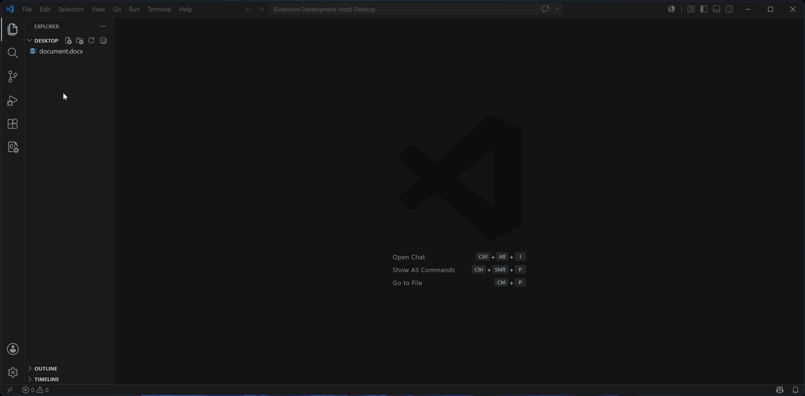
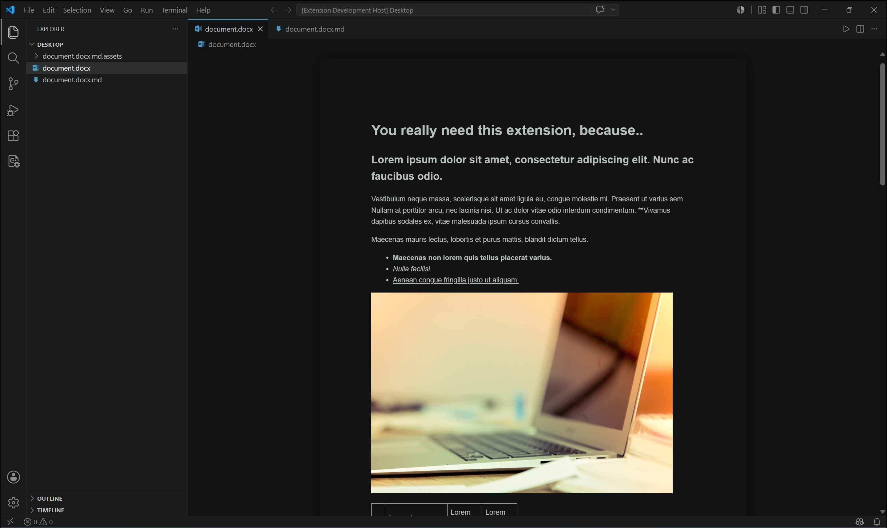
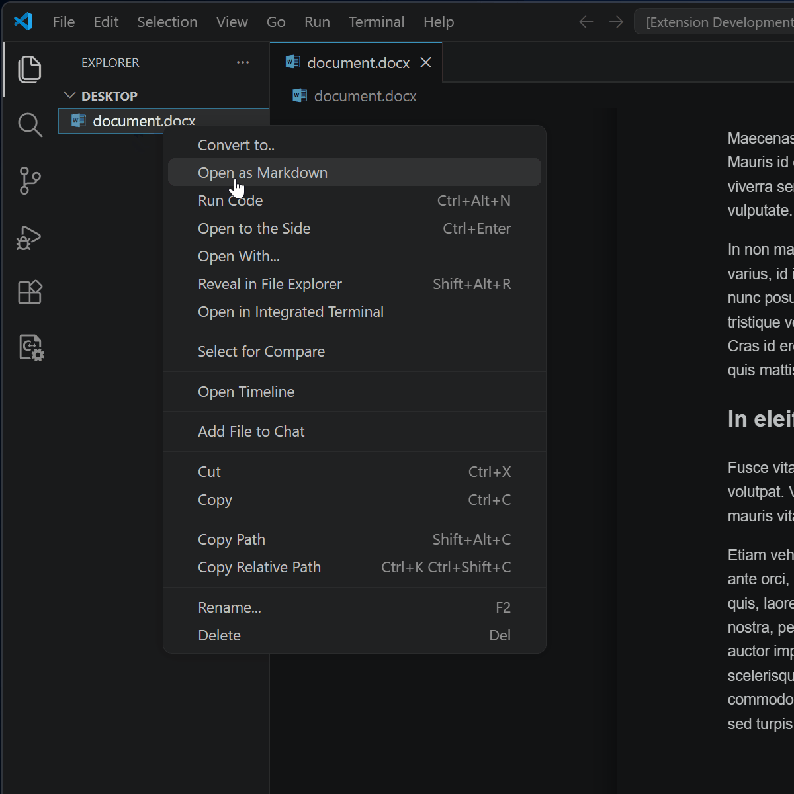
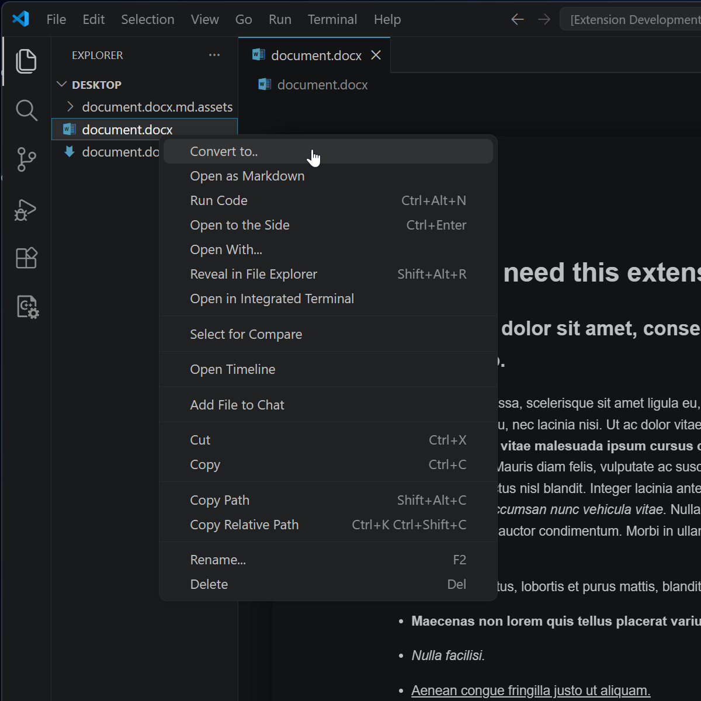
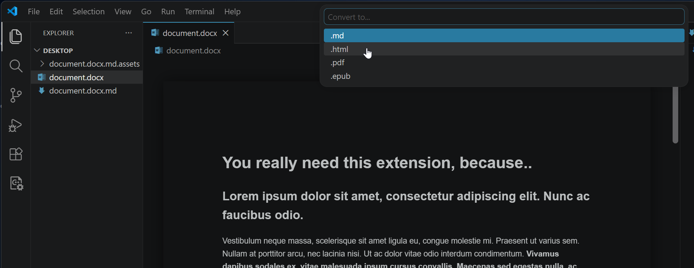

# Docx Markdown Editor

Preview DOCX files directly in VS Code, edit them as Markdown, and automatically synchronize changes back to the original .docx using Pandoc.

  

## Features

- Preview `.docx` files directly in VS Code
- Open `.docx` files as Markdown for editing
- Automatically sync Markdown changes back to the original `.docx`
- Convert between Markdown, DOCX, HTML, PDF and EPUB
- Create new blank `.docx` documents
- Automatically download Pandoc if it is not installed

## Requirements

Converting `.pdf` files requires an installed PDF engine.

If Pandoc is not available on your system, the extension automatically downloads and installs a local copy on first use.

## Screenshots

| DOCX Preview |
|------------------|
||

| Open as Markdown | Convert to |
|------------------|------------|
|| |

| Conversion |
|------------------|
||

## Usage

1. Click a `.docx` file in Explorer to open its preview.
2. Right-click a folder and choose **New .docx..** to create a blank document.
3. Right-click a `.docx` file in Explorer.
4. Choose **Open as Markdown**.
5. Edit the generated `.md` file.
6. Save the file to write changes back to `.docx`.
7. The preview updates automatically whenever the `.docx` file changes.

## Conversion

- `.docx` -> `.md`, `.pdf`, `.html`, `.epub`
- `.md`   -> `.docx`, `.pdf`, `.html`, `.epub`
- `.html` -> `.md`, `.docx`, `.pdf`, `.epub`
- `.epub` -> `.md`, `.docx`, `.html`, `.pdf`

## Notes

- Temporary Markdown files are created alongside the source as `.docx.md`.
- Opening a `.docx` file as Markdown creates a `<document>.docx.md.assets` folder containing extracted images and other embedded resources. Do not remove this folder while editing the Markdown file.
- Newly created documents start as `new-document.docx` and can be renamed immediately.
- Pandoc is automatically downloaded and installed locally if it is not already available.
- Logging to the Output.

## Release Notes

See [CHANGELOG.md](./CHANGELOG.md) for version history.